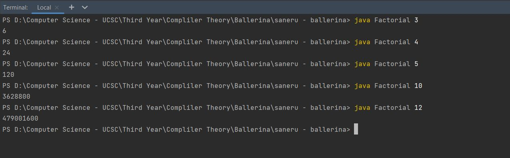
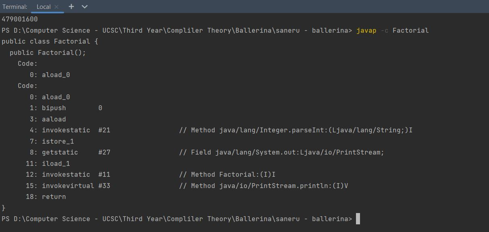

# Ballerina-FactorialCompiler
Factorial Calculation Compiler build from scratch using ASM and Java inspired from the Ballerina Session Conducted at UCSC by WSO2

## Test Cases

### Tested Outputs

### javap -c Factorial File

